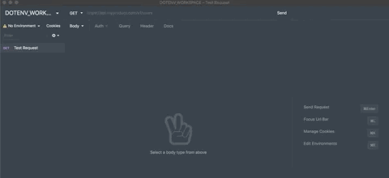
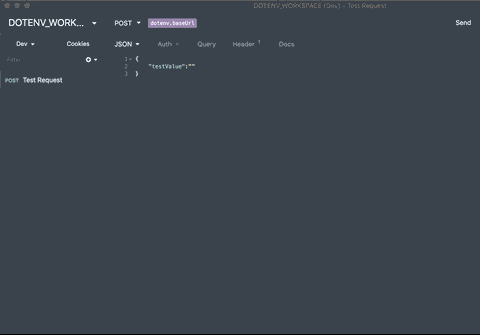
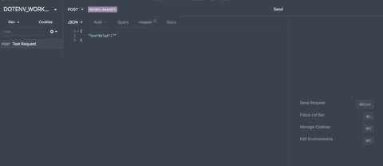
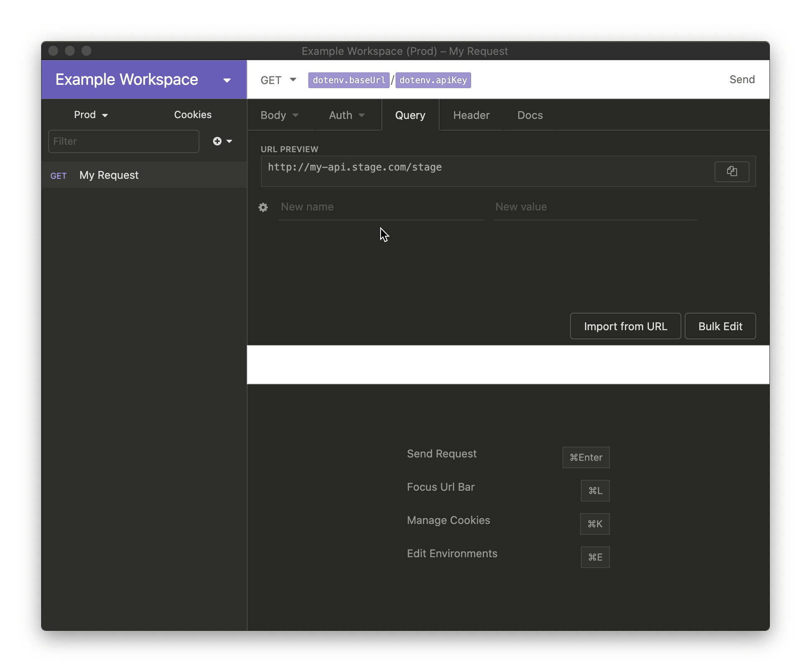
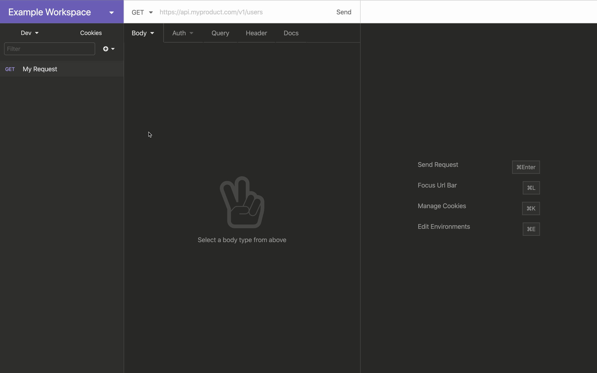
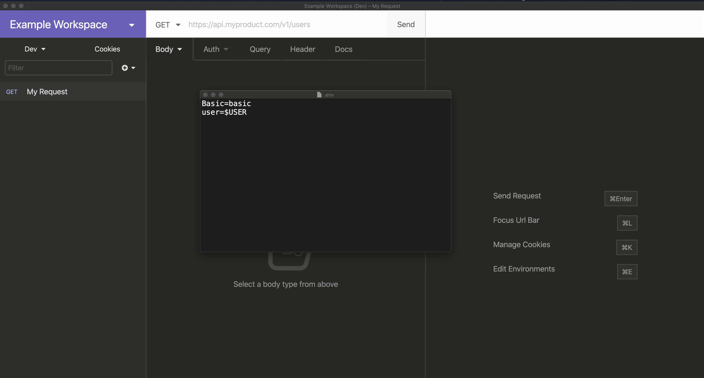

# Insomnia Plugin - dotenv
 

Fetch data from a .env file.

### Installation:

- Open Insomnia options (Ctrl + , | Cmd + ,)
- Type `insomnia-plugin-dotenv` on the **Plugins** tab

### Usage:
- To load `.env` file via system dialog

- To add `.env` via environment variable

- Multiple users can use relative path, which resolves to their specific location

- Add Environment variables inside your .env file, it will be expanded automatically

